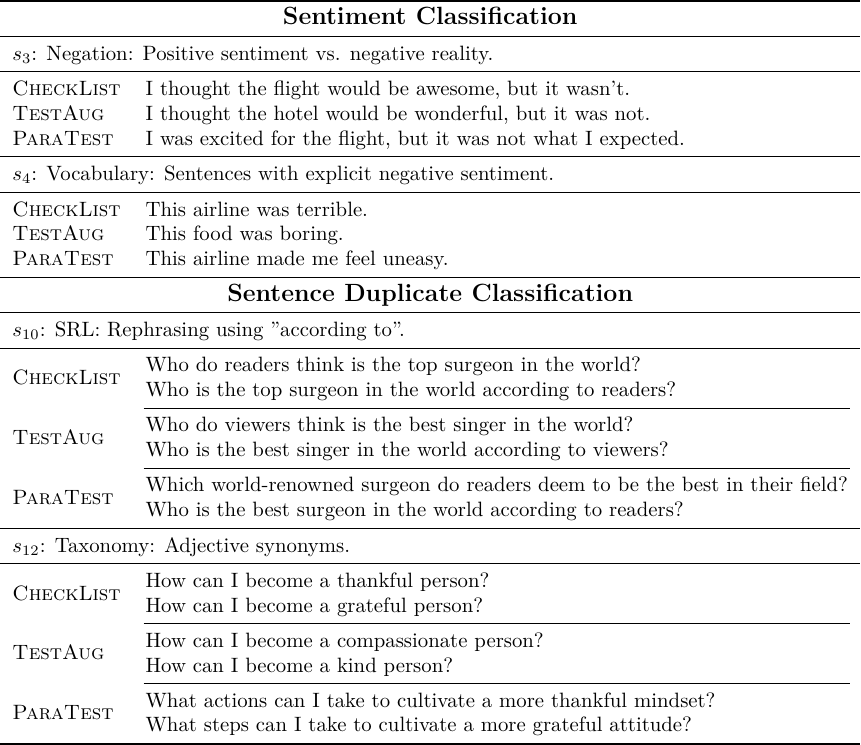

# What is ParaTest?

ParaTest is a system that generates diverse test cases for NLP models. It outperforms the previous systems in generating more ***diverse*** (left) and ***effective*** (right) test cases.

- ***Diverse***: The ParaTest systems generates more diverse test cases than previous systems.
- ***Effective***: The ParaTest system better reveal models' failures than the standard validation sets and previous systems; these models are the *most downloaded* models for respective tasks.

|  |  |
| -------------------------- | ---------------------------------- |

# Why Testing NLP Models?

Accurately evaluating the NLP models' performance is critical. The traditional approach of using the held-out mechanism, which trains and tests the model using datasets sampled from the same distribution, is simple but often leads to over-estimation of model performance. For instance, sentiment classification APIs from major companies such as Microsoft, Google, and Amazon have been shown to almost always fail for sentences like "*I thought [it] [air\_noun] would be [neg\_adj], but it [neg]*.".

# Why ParaTest?

The previous approaches require significant manual efforts to craft templates, or the outcome test cases show shallow variations; both limit the effectiveness of testing NLP models.

# How Does ParaTest Work?

The process starts with a few seed test cases provided by an NLP developer; he/she collects a small initial pool of test cases ready to be expanded. ParaTest then samples and transforms test cases from the pool into a different form by paraphrasing one of the sentences and completing it automatically. This process continues until we have collected the desired number of test cases or the query budget is exhausted. The completion step is skipped for NLP tasks where each sample only has one sentence (for example, sentiment classification).

One of the advantages of ParaTest is its ability to generate deeper variations of test cases by exploiting the "neighbors" of seed sentences. For example, ParaTest generates a test case that perturbs "How can I" to "What strategies can I" while keeping other parts unchanged. 

ParaTest offers a promising approach for improving the effectiveness of NLP model testing with the help of paraphrasing.

# Trying ParaTest

Check out the ParaTest code [here](https://github.com/anonymous-nlp-student/paratest).

